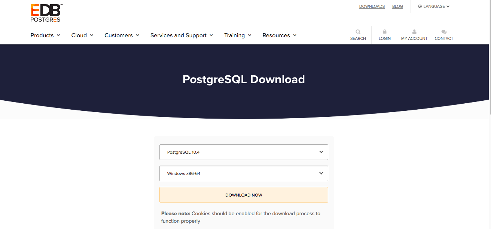
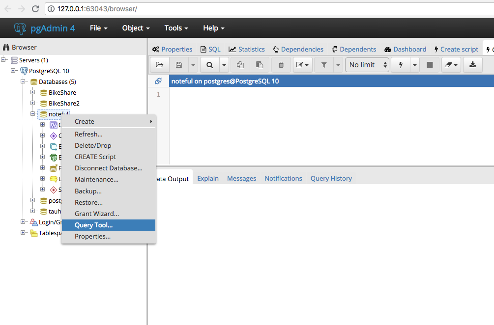
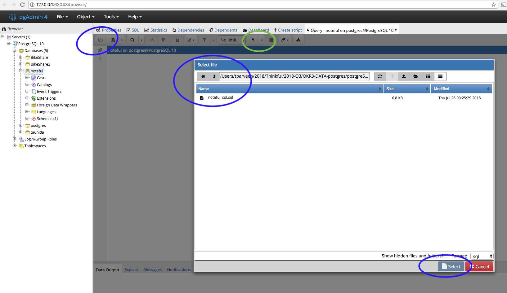
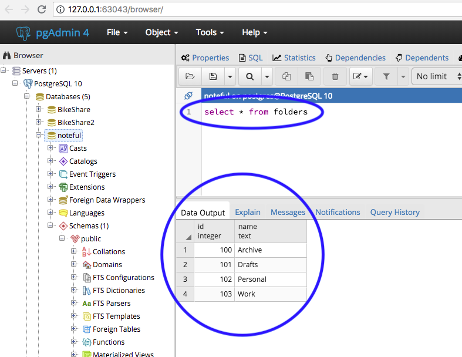

In this reading, we'll go through setting up Postgres locally.

Mac and Windows users will find separate instructions.

## Setting up Postgres on Mac

* Go to [the Postgres download site](https://www.postgresql.org/download/macosx/) and click `Download the installer` for EnterpriseDB.
* Select the most recent stable release (which should be the topmost one) for MacOS.

* Once you download it, find the `.dmg` file on your local machine and double click it to run it. 
* Choose the default options when the installer runs.
* You'll be asked to provide a password for the Postgres user, which is the default super user for Postgres. 
* Be sure to make a note of the password you choose, as you'll need it later. 
* It may take a minute or two for the installation to complete.
* When it does complete, you may be asked to run `StackBuilder` to download and install additional tools. Choose **No**.
* Once the installation is complete, find open spotlight on your Mac and find `pgAdmin`. pgAdmin is the graphical interface for Postgres and it comes with your Postgres installation.
* pgAdmin will open in a browser on the Mac as follows: 

 

## Setting up Postgres on Windows

* Go to [the Postgres download site](https://www.postgresql.org/download/windows/) and click `Download the installer` for EnterpriseDB.
* From the installer options, select the most recent version and `Windows x86-64` for operating system.

   

* When the download completes, find it in your download folder. Double click on the file to start the installer.
* Choose the default options when the installer runs.
* You'll be asked to provide a password for the Postgres user, which is the default super user for Postgres.
* Be sure to make a note of the password you choose, as you'll need it later. 
* It may take a minute or two for the installation to complete.
* When it does complete, you may be asked to run `StackBuilder` to download and install additional tools. Choose **No**.
* Once the installation is complete, go to your start menu, you should see pgAdmin Icon. It is the graphical interface for Postgres. Click to open the application.

## Creating a database using pgAdmin

* On the left side of the `pgAdmin` dashboard, if you click on the `Servers`, it will ask you for a password. Use the password you created when you were installing Postgres.
* Once you type in your password, you will see that it shows you all the information about your database(s). If you click on `PostgreSQL` under servers, it shows you the databases that you have. You can see that a database called by `postgres` is already created there for you.
* If you want to create another database, right click on the `Databases -> Create -> Database`, give your database a name. Keep the default `postgres` as the owner.

* Lets create a database and load some data into the database. We will use pagAdmin's interface to do this. Note that if you have a very large dataset, you will have to use your terminal and use `psql` commands to create your database and load your data. Right now, we will use small set of data and pgAdmin should be able to handle that.

* We will create a database called `Noteful`using the schema found in [this noteful_sql.sql file](noteful_sql.sql).
* Download the file.
* Back to your `pgAdmin` dashboard, right click on the `Databases -> Create -> Database` and create a database called `Noteful`.
* Right click on `Noteful` database and select `Query Tool...`

* Click on the `open file` icon and it should open a file chooser box. Find the location where you downloaded the `noteful_sql.sql` file, select the file and click on the `select` button. 

* Click on the `Execute/Refresh` icon (shown above in green)
* You should get a `Query returned successfully...` message after the file executes. 
* In the query tool, try a few sql queries to see if your database was created successfully. for example, run
    `select * from folders`
* It should show you the content of the table `folders`.

